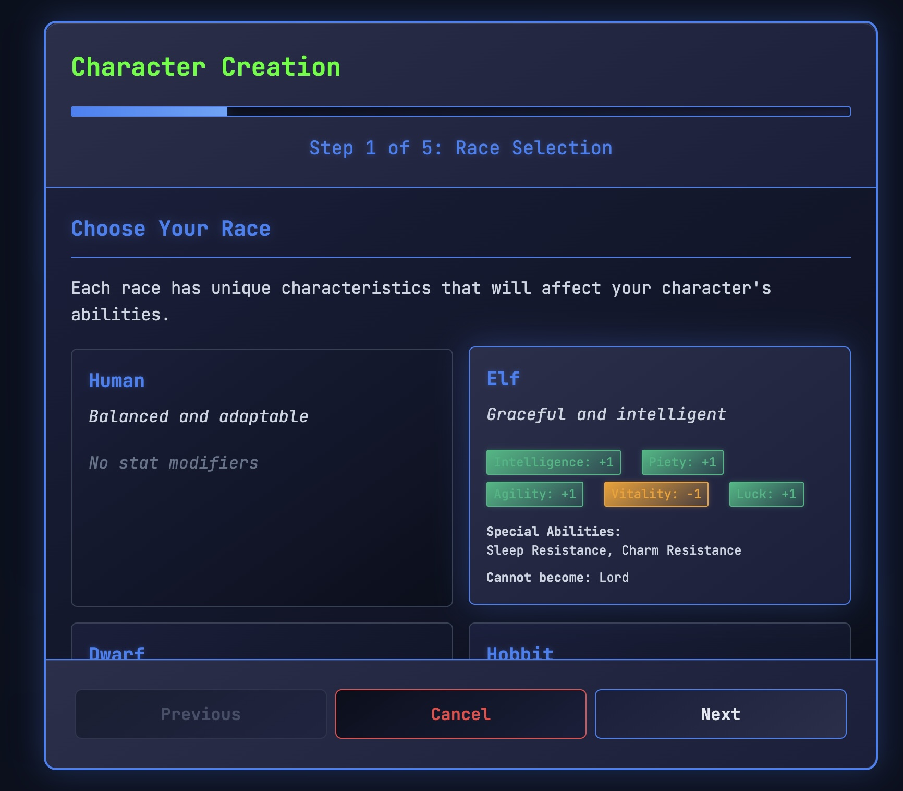
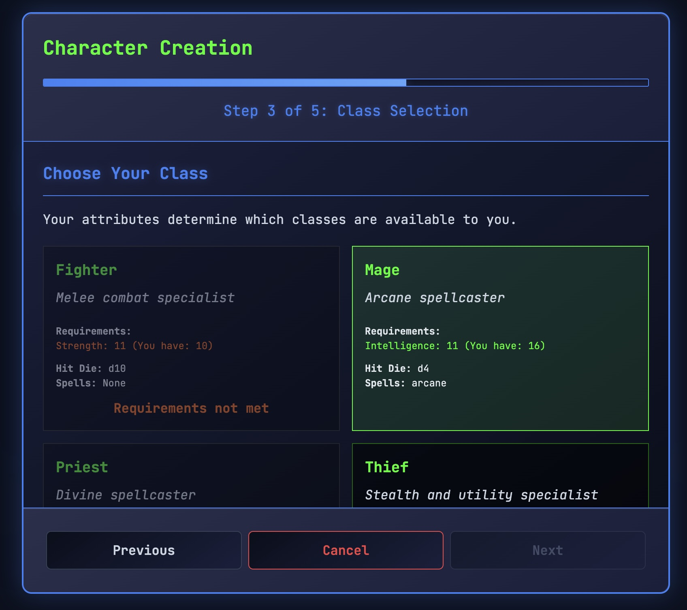
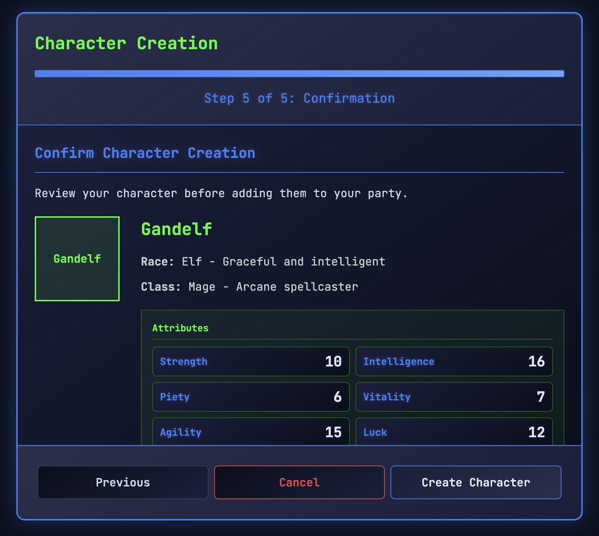
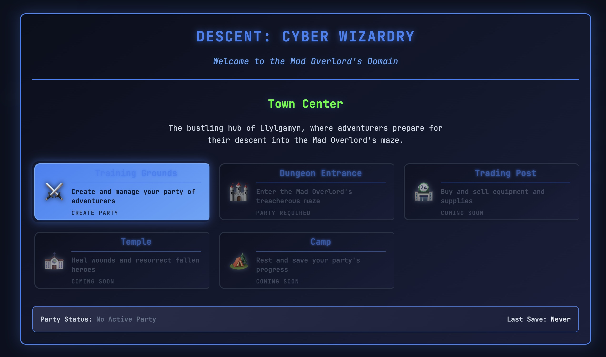
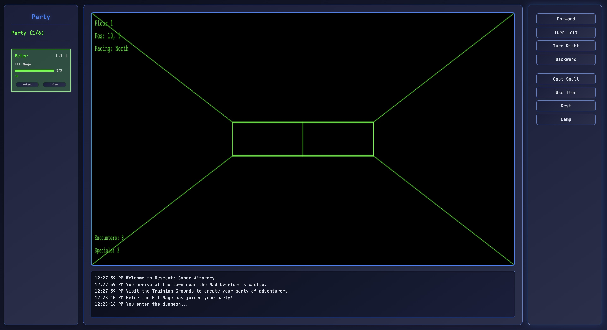

# Descent: Cyber Wizardry


**Built with:** Cursor + Claude Code | **Models:** Claude 4.0 Sonnet

A modern browser-based homage to the classic dungeon crawler Wizardry, reimagined with a cyberpunk aesthetic. Currently in early development with core systems and character creation implemented.

## Current Development Status

🚧 **Early Development** - Foundation systems are in place with character creation and UI systems implemented.

### ✅ Implemented Features
- **Character Creation System**: Complete with race and class selection
- **Core Game Engine**: Event system, game state management, and rendering foundation
- **UI Framework**: Modal dialogs, character interfaces, and game menus
- **Cyberpunk Aesthetic**: Terminal-inspired interface with retro-modern styling

### 🏗️ In Progress
- Dungeon exploration and navigation
- Combat system implementation
- Party management mechanics
- 3D wireframe rendering

## Screenshots

### Character Creation Flow
<div align="center">

**Race Selection**


**Class Selection**


**Character Confirmation**


**Town Menu**


**Dungeon Interface**


</div>

## Test room

  0 1 2 3 4 5 6 7 8  (x coordinates)
0 █ █ █ █ █ █ █ █ █  
1 . . . █ █ . . . █  (Room A)    (Room B)
2 . p . . . . . . █  (Room A)(corridor)(Room B)
3 . . . █ █ . . . █  (Room A)    (Room B)
4 █ █ █ █ █ █ █ █ █  

There is no Western wall in Room A as that is the Eastern wall of Room B due to our wrap-around mapping implementations

## Planned Features

- **Classic Dungeon Crawling**: First-person 3D wireframe exploration
- **Rich Character System**:
  - 5 Playable Races: Human, Elf, Dwarf, Hobbit, Gnome
  - 8 Character Classes: Fighter, Mage, Priest, Thief + 4 Elite Classes
  - Authentic attribute system with racial modifiers
- **Party Management**: Form and lead a party of up to 6 adventurers
- **Turn-Based Combat**: Strategic battles with classic RPG mechanics
- **Retro-Modern Interface**: Cyberpunk-themed UI with terminal aesthetics

## Getting Started

1. Clone the repository
2. Open `index.html` in a modern web browser
3. No additional installation or dependencies required

## Development

The project uses vanilla JavaScript and HTML5 Canvas for rendering, with a focus on modularity and maintainability. 

### Project Structure
```
src/
  ├── core/      # Game engine and state management
  ├── rendering/ # Canvas and UI systems
  ├── game/      # Game logic and mechanics
  └── utils/     # Helper functions and utilities
```

### Key Systems
- **Engine.js**: Core game loop and initialization
- **GameState.js**: State management and persistence
- **EventSystem.js**: Event handling and communication
- **UI.js**: Interface components and modal systems
- **CharacterCreator.js**: Character generation system

## Contributing

Currently in active development. The project is in early stages with core systems being established. Issues and pull requests welcome.

## License

MIT License - see [LICENSE](LICENSE) file for details.