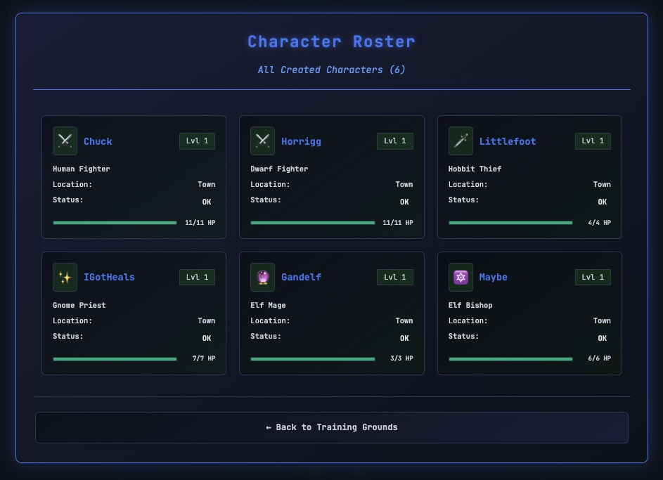
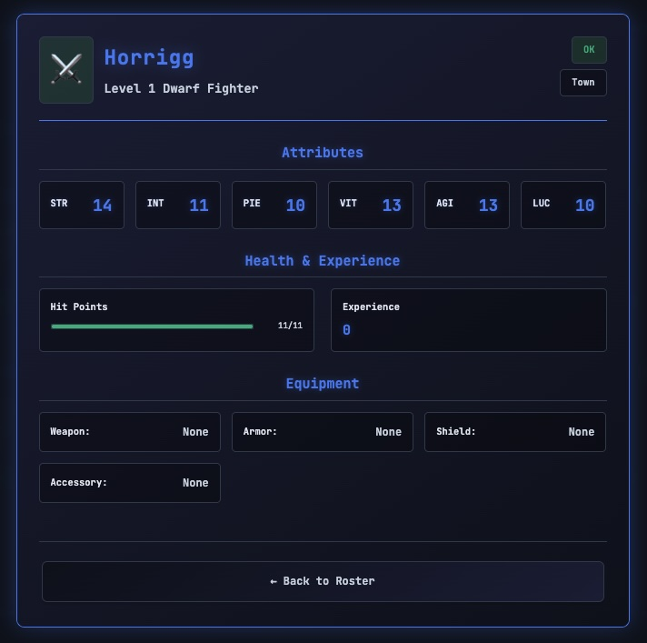
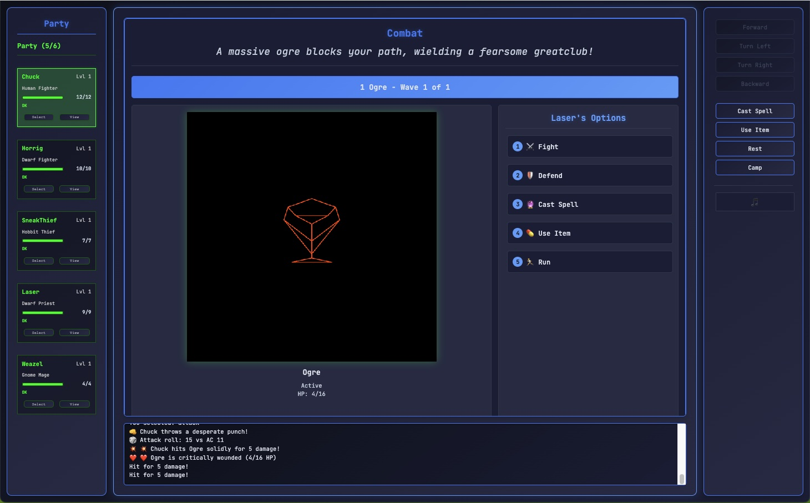
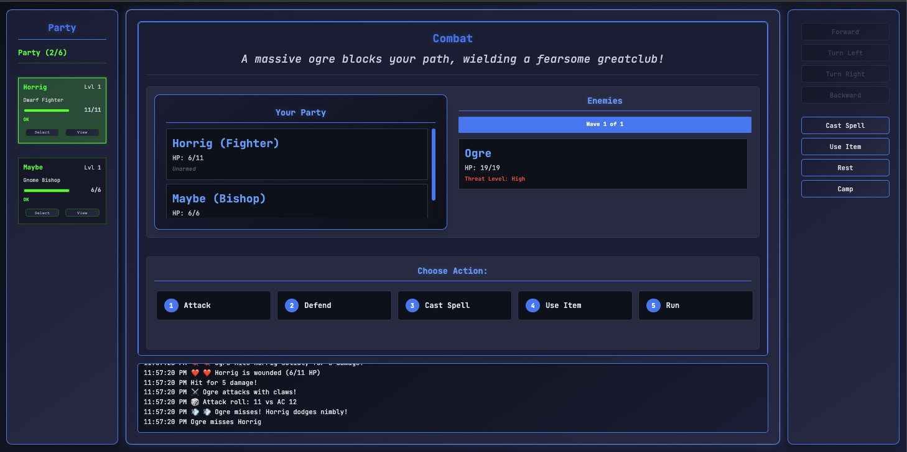
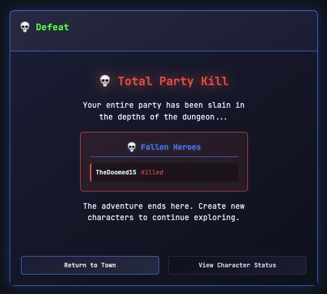
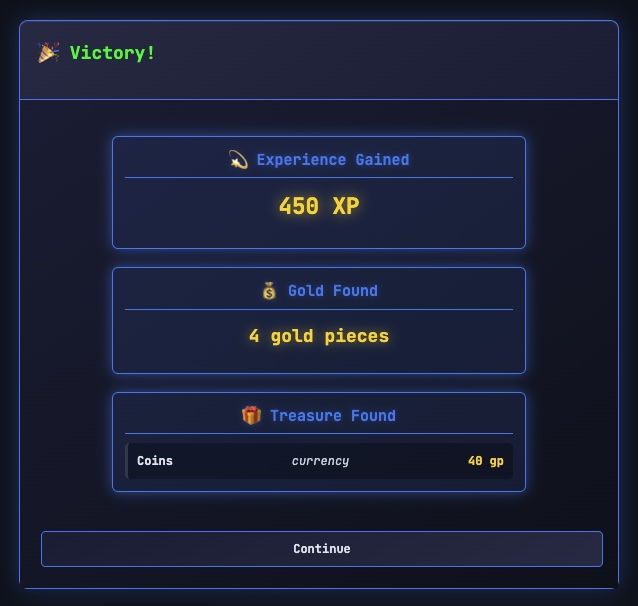

# Descent: Cyber Wizardry


**Built with:** Cursor + Claude Code | **Models:** Claude 4.0 Sonnet

A modern browser-based homage to the classic dungeon crawler Wizardry, reimagined with a cyberpunk aesthetic set witin a Tron inspired world. Recently enhanced with 3D wireframe monster portraits. Experience authentic turn-based RPG combat with striking visual presentation.

## Current Development Status

🎯 **Enhanced Visual Combat** - Core foundation systems are complete with dramatic 3D wireframe monster portraits transforming the combat experience.

### ✅ Implemented Features
- **3D Monster Portraits**: Striking wireframe vector graphics with cyberpunk aesthetic
- **Enhanced Combat Interface**: Dramatic monster-focused layout with health visualization
- **Character Creation System**: Complete with race and class selection
- **Core Game Engine**: Event system, game state management, and rendering foundation
- **UI Framework**: Modal dialogs, character interfaces, and game menus
- **Storage System**: Character persistence and game state management
- **Cyberpunk Aesthetic**: Terminal-inspired interface with retro-modern styling
- **3D Wireframe Viewport**: Advanced dungeon rendering system with monster portrait integration
- **Combat System**: Full party vs party turn-based battles with unconscious/death mechanics
- **Retro Chiptune Audio**: Dynamic background music system with Web Audio API synthesis
- **Dungeon Encounters**: Fixed boss placement and deterministic encounter triggering

### 🏗️ In Progress
- **Magic System**: Spell casting and memorization mechanics
- **Equipment System**: Weapon and armor management beyond unarmed combat
- **Advanced Monster Models**: Additional creature wireframe designs and visual effects
- **Party Formation**: Strategic positioning and formation-based combat bonuses

## Screenshots

### Character Creation Flow
<div align="center">

**Town Menu**


**Race Selection**


**Class Selection**


**Character Confirmation**


**Character Roster**


**Character Detail**


**Dungeon Interface**


**Enhanced Combat with 3D Monster Portraits**


**Classic Combat Interface**


**Post Combat**


**Post Combat - Victory**


</div>

## Test Room & Combat System

### Training Grounds Layout
```text
  0 1 2 3 4 5 6 7 8  (x coordinates)
0 █ █ █ █ █ █ █ █ █  
1 . . . █ █ . . . █  (Room A)    (Room B)
2 . p . . O . . . █  (Room A)(corridor)(Room B)
3 . . . █ █ . . . █  (Room A)    (Room B)
4 █ █ █ █ █ █ █ █ █  

p = player start position (1,2)
O = fixed Ogre encounter at (4,2)
```

### Enhanced Combat Experience
Face the imposing Ogre in dramatic 3D wireframe portrait glory! The new combat interface features:

### Combat Features
- **3D Monster Portraits**: Striking wireframe visualizations with authentic cyberpunk aesthetic
- **Health Visualization**: Dynamic color-coded status (Green → Orange → Red → Gray)
- **Dramatic Combat Layout**: Monster-focused presentation (2/3 monster vs 1/3 actions)
- **Party vs Party**: Authentic multi-wave encounter system supporting sequential enemy groups
- **Turn-based Initiative**: Proper Wizardry-style turn order with unconscious character handling
- **Real-time UI Updates**: Character health and status update dynamically during combat
- **Dramatic Combat Log**: Color-coded messages with emojis and flavor text for all actions

## Planned Features

- **Classic Dungeon Crawling**: First-person 3D wireframe exploration
- **Rich Character System**:
  - 5 Playable Races: Human, Elf, Dwarf, Hobbit, Gnome
  - 8 Character Classes: Fighter, Mage, Priest, Thief + 4 Elite Classes
  - Authentic attribute system with racial modifiers
- **Party Management**: Form and lead a party of up to 6 adventurers
- **Turn-Based Combat**: Strategic battles with classic RPG mechanics and 3D monster visualization
- **Retro-Modern Interface**: Cyberpunk-themed UI with terminal aesthetics and wireframe graphics

## Getting Started

1. Clone the repository
2. Open `index.html` in a modern web browser
3. No additional installation or dependencies required

## Development

The project uses vanilla JavaScript and HTML5 Canvas for rendering, with a focus on modularity and maintainability. Features complete 3D wireframe monster portrait system alongside foundational RPG mechanics.

### Project Structure
```
src/
  ├── core/      # Game engine and state management
  ├── rendering/ # Canvas, UI systems, and 3D monster portraits
  ├── game/      # Game logic and mechanics
  ├── utils/     # Helper functions and utilities
  └── data/      # Game data and migrations
```

### Key Systems
- **Engine.js**: Core game loop and initialization
- **GameState.js**: State management and persistence
- **EventSystem.js**: Event handling and communication
- **UI.js**: Interface components and modal systems
- **Storage.js**: Data persistence and character management
- **Combat.js**: Turn-based battle system with party vs party mechanics
- **AudioManager.js**: Retro chiptune music synthesis and dynamic soundtrack
- **CombatInterface.js**: Combat UI and player action processing
- **MonsterPortraitRenderer.js**: 3D wireframe monster visualization system
- **Viewport3D.js**: Advanced 3D rendering engine for dungeon and monster graphics

## Contributing

The project now features a complete visual combat experience with 3D wireframe monster portraits, dynamic chiptune audio, and enhanced combat interface. The "first doomed exploration" in the training grounds showcases dramatic monster visualization with authentic Wizardry mechanics. While core systems are solid, many RPG features await implementation. Issues and pull requests welcome as development continues.

**Current State**: Create characters, enter the training grounds, and face the mighty Ogre rendered in striking 3D wireframe glory! Experience either victory or dramatic party wipe with full audio accompaniment and enhanced visual presentation. The combat interface now features imposing monster portraits that capture the cyberpunk aesthetic while maintaining authentic Wizardry challenge.

## License

MIT License - see [LICENSE](LICENSE) file for details.