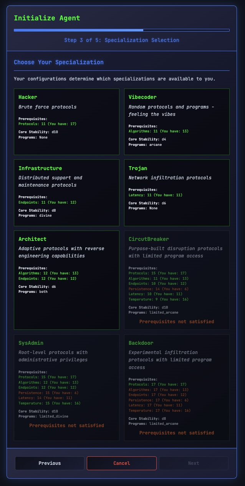

# Descent: Cyber Wizardry


**Built with:** Cursor + Claude Code | **Models:** Claude 4.0 Sonnet

A modern browser-based homage to the classic dungeon crawler Wizardry, featuring a unique dual-mode system that switches between classic fantasy and cyberpunk aesthetics. Experience authentic turn-based RPG combat with striking 3D wireframe monster portraits in a persistent dungeon world.

## Current Development Status

🎯 **Persistent Dungeon World** - Core RPG systems are implemented with a complete dual-terminology system supporting both classic fantasy and cyberpunk themes. Recent focus on treasure mechanics and shared dungeon architecture.

### ✅ Implemented Features
- **Dual-Mode System**: Complete terminology switching between classic fantasy and cyberpunk modes
- **Character Creation**: Full character creation with dual terminology ("Create Character" ↔ "Initialize Agent")
- **3D Monster Portraits**: Five wireframe monster models with cyberpunk visual effects
- **Combat System**: Turn-based party combat with Grid Engagement interface
- **Persistent Dungeons**: Shared dungeon world with treasure chests and loot generation
- **Audio System**: Dynamic chiptune music with contextual sound effects
- **Storage System**: Complete character and party persistence with IndexedDB
- **Advanced RPG Mechanics**: Death system, rest system, spell memorization, equipment management

### 🔄 In Development
- **Magic System Enhancement**: Improved spell casting interface with digital algorithm terminology
- **Advanced Treasure Mechanics**: Chest types, trap systems, rare loot generation
- **Rescue Party System**: Multi-party interaction in shared dungeon environments

### 🧪 Experimental Features
- **Wizardry-Tron Fusion**: 75% complete transformation supporting dynamic terminology switching
- **Program Classifications**: Monster types displayed as digital classifications in cyber mode
- **Equipment Cyber Terminology**: Items with dual naming (e.g., "Dagger" ↔ "Blade Subroutine")

## Dual-Mode Experience

The game features a unique dual-terminology system that transforms the entire experience:

**Classic Mode**: Traditional fantasy RPG with parties, characters, dungeons, and magic
**Cyber Mode**: Cyberpunk aesthetic with strike teams, agents, grid networks, and programs

<div align="center">

<table>
  <tr>
    <td align="center">
      <br/>
      <b>Fantasy Mode - Classic Wizardry</b>
    </td>
    <td align="center">
      <br/>
      <b>Cyber Mode - Tron Aesthetic</b>
    </td>
  </tr>
</table>

</div>

## Character Creation System

Complete character creation with dual terminology support:

<div align="center">

<table>
  <tr>
    <td align="center">
      <br/>
      <b>Choose Your Race</b>
    </td>
    <td align="center">
      <br/>
      <b>Choose Your Platform</b>
    </td>
  </tr>
  <tr>
    <td align="center">
      <br/>
      <b>Your Attributes</b>
    </td>
    <td align="center">
      <br/>
      <b>Your Configuration</b>
    </td>
  </tr>
  <tr>
    <td align="center">
      <br/>
      <b>Choose Your Class</b>
    </td>
    <td align="center">
      <br/>
      <b>Choose Your Specialization</b>
    </td>
  </tr>
</table>

</div>

## Current Playable Experience

### Training Grounds (Test Environment)
```text
  0 1 2 3 4 5 6 7 8  (x coordinates)
0 █ █ █ █ █ █ █ █ █  
1 . . . █ █ . . . █  (Room A)    (Room B)
2 . p . . O . T . █  (Room A)(corridor)(Room B)
3 . . . █ █ . . . █  (Room A)    (Room B)
4 █ █ █ █ █ █ █ █ █  

p = player start position (1,2)
O = fixed Ogre encounter at (4,2)
T = treasure chest at (6,2)
```

### What You Can Do
- **Create Characters**: Full character creation with 5 races and 8 classes
- **Form Parties**: Create and manage party compositions
- **Explore Dungeons**: Navigate the training grounds with 3D wireframe rendering
- **Combat Encounters**: Face monsters in turn-based combat with 3D wireframe portraits
- **Collect Treasures**: Discover treasure chests with randomized loot
- **Audio Experience**: Dynamic chiptune music and sound effects
- **Mode Switching**: Toggle between fantasy and cyberpunk terminology

### Combat System
- **Turn-Based Combat**: Classic Wizardry-style party vs monster encounters
- **3D Monster Portraits**: Five wireframe models with health-based visual effects
- **Grid Engagement**: Cyberpunk-themed combat interface with digital terminology
- **Party Management**: Handle unconscious/dead party members with casualty removal
- **Formation System**: Front and back row positioning affects combat

### Technical Features
- **Persistent Storage**: Characters and progress saved using IndexedDB
- **Shared Dungeon World**: Multiple parties can explore the same dungeon instance
- **Dynamic Terminology**: Real-time switching between classic and cyber terms
- **Audio Integration**: Web Audio API with generated chiptune music
- **Responsive Design**: Works across different screen sizes and devices

## Getting Started

1. Clone the repository
2. Open `index.html` in a modern web browser
3. No installation required - runs entirely in the browser

## Current Limitations

While the game has solid foundations, it's still in active development:

- **Limited Content**: Only training grounds dungeon available
- **Basic Magic System**: Spell casting implementation is basic
- **Equipment System**: Limited equipment interactions beyond basic stats
- **AI Behaviors**: Monster AI is functional but simple
- **Dungeon Variety**: Currently only one test dungeon

## Development Architecture

The project uses vanilla JavaScript with a modular architecture:

### Core Systems
- **Engine.js**: Main game loop and event handling
- **Combat.js**: Turn-based combat mechanics
- **Dungeon.js**: Maze generation and exploration
- **Storage.js**: Data persistence and party management
- **TextManager.js**: Dynamic terminology switching
- **AudioManager.js**: Music and sound effect synthesis

### Key Features
- **46 JavaScript files** totaling over 28,000 lines of code
- **Entity-based data system** with migration support
- **Dual-terminology system** with 80+ mapped terms
- **3D wireframe rendering** for authentic retro aesthetics
- **Complete audio system** with dynamic music generation

## Technical Highlights

- **No External Dependencies**: Pure vanilla JavaScript implementation
- **Modern Web APIs**: Uses Canvas, IndexedDB, and Web Audio API
- **Modular Design**: Clean separation of concerns across 46 files
- **Event-Driven Architecture**: Robust event system for UI updates
- **Performance Optimized**: Efficient rendering and storage systems

## Contributing

The project is actively developed and welcomes contributions. Key areas for improvement:

- **Content Creation**: More dungeons, monsters, and equipment
- **Magic System**: Enhanced spell casting mechanics
- **AI Improvements**: More sophisticated monster behaviors
- **UI/UX Enhancements**: Better visual feedback and animations
- **Audio Content**: Additional music tracks and sound effects

## License

MIT License - see [LICENSE](LICENSE) file for details.

---

*A passion project exploring the intersection of classic RPG mechanics and modern web technologies, with a unique dual-mode system that transforms the entire game experience.*
