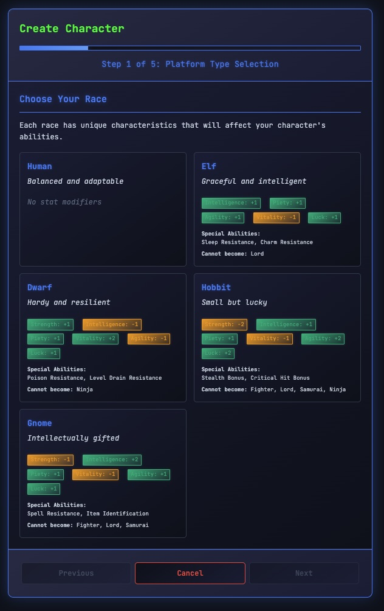

# Descent: Cyber Wizardry


**A modern browser-based homage to the classic dungeon crawler Wizardry, featuring a unique dual-mode system that transforms the game between classic fantasy and cyberpunk aesthetics.**

<div align="center">

<table>
  <tr>
    <td align="center">
      <br/>
      <b>3D Wireframe Dungeon</b>
    </td>
    <td align="center">
      <br/>
      <b>Turn-Based Combat</b>
    </td>
  </tr>
</table>

</div>

Experience authentic turn-based RPG combat, persistent dungeon exploration, and deep party management mechanics—all rendered in a striking 3D wireframe style with procedurally generated chiptune audio.

---

## Two Worlds, One Engine

Toggle between fantasy and cyberpunk at any time. This isn't just a skin—it's a complete semantic translation layer affecting all text, terminology, and theming.

<div align="center">

<table>
  <tr>
    <td align="center">
      <br/>
      <b>Fantasy Mode</b><br/>
      <i>"Dwarven Priest" • "Dungeon" • "Party"</i>
    </td>
    <td align="center">
      <br/>
      <b>Cyber Mode</b><br/>
      <i>"Iron Kernel Infrastructure" • "Corrupted Network" • "Strike Team"</i>
    </td>
  </tr>
</table>

</div>

---

## Key Features

### 🧊 3D Wireframe Rendering
Authentic retro-3D rendering built from scratch using HTML5 Canvas. Features proper perspective, occlusion culling, and a real-time mini-map with fog of war.

<div align="center">

<table>
  <tr>
    <td align="center">
      
    </td>
    <td align="center">
      
    </td>
    <td align="center">
      
    </td>
  </tr>
  <tr>
    <td align="center"><i>Corridor Exploration</i></td>
    <td align="center"><i>Doors & Secrets</i></td>
    <td align="center"><i>Fog of War Mini-map</i></td>
  </tr>
</table>

</div>

### ⚔️ Grid Engagement Combat
Tactical turn-based combat with 3D wireframe monster portraits that react to damage with glitching and fragmentation effects.

<div align="center">
  <br/>
  <i>3D Monster Portraits with Health-Based Visual Effects</i>
</div>

<br/>

- **Formation Strategy**: Front/back row positioning affects damage and targeting
- **Initiative System**: Agility and class bonuses determine turn order
- **Monster AI**: Different behavior patterns (aggressive, tactical, pack, intelligent)

### 📜 Deep Party Management
Create characters from 5 races and 8 classes. Manage multiple parties in a persistent shared world. Handle permadeath, resurrection, and future rescue missions.

<div align="center">

<table>
  <tr>
    <td align="center">
      <br/>
      <i>Character Creation</i>
    </td>
    <td align="center">
      <br/>
      <i>Party Formation</i>
    </td>
  </tr>
</table>

</div>

### 🎵 Procedural Audio
Custom-built audio engine generating situational chiptune music and sound effects using the Web Audio API. No external audio files—pure code-generated synthesis with 5 dynamic tracks and 19+ sound effects.

### 💾 Persistent World
Robust IndexedDB storage saves every step. Characters, parties, dungeon progress, and fog of war are all persistently stored locally. Multiple parties share the same dungeon instance.

---

## Recent Changes

### Mini-Map Navigation
Real-time 2D mini-map with fog of war rendering. Explored tiles persist across sessions and are shared between all parties in the same dungeon. The player arrow rotates to indicate facing direction.

### Monster Rendering
Monsters now appear in both the 3D dungeon viewport and on the mini-map. Encounter positions are tracked and displayed, giving players situational awareness before engaging in combat.

### Visual & Audio Polish
- Updated CSS styling with improved cyberpunk glow effects
- New victory chiptune track
- Refined dungeon theme with dynamic intensity modes
- Enhanced UI transitions and feedback

---

## Getting Started

```bash
# Clone
git clone https://github.com/RogueCtrl/Descent-Cyber-Wizardry.git
cd Descent-Cyber-Wizardry

# Launch (recommended for audio)
python -m http.server 8000
# Then open http://localhost:8000

# Or just open index.html directly in any modern browser
```

No build steps. No npm install. No dependencies. Just pure vanilla web technologies.

---

## Technical Architecture

The project demonstrates modern capability using only vanilla standards:

| Component | Technology |
|-----------|------------|
| **Core** | Pure Vanilla JavaScript (ES2024+) |
| **Rendering** | HTML5 Canvas (2D Context for 3D projection) |
| **Audio** | Web Audio API (Oscillator synthesis) |
| **Storage** | IndexedDB v7 with migration system |
| **Styling** | Modern CSS3 (Variables, Grid, Flexbox) |

**~32,000 lines of JavaScript** across 51 files, organized into:
- `src/core/` - Engine, events, state machine
- `src/game/` - Combat, dungeon, characters, parties
- `src/rendering/` - 3D viewport, portraits, UI
- `src/audio/` - Procedural music and sound
- `src/data/` - Terminology, entity migrations

Detailed system documentation: [`docs/systems/`](docs/systems/)

---

## Game Content

| Category | Content |
|----------|---------|
| **Races** | Human, Elf, Dwarf, Hobbit, Gnome |
| **Classes** | Fighter, Mage, Priest, Thief, Bishop, Samurai, Lord, Ninja |
| **Spells** | 50+ across 7 levels (arcane & divine) |
| **Equipment** | 75+ items with dual terminology |
| **Monsters** | 12+ types with 3D wireframe portraits |
| **Audio** | 5 tracks, 19+ sound effects |

---

## Development & Credits

This project explores AI-assisted software engineering.

**Built by**: Matt Cox

**AI Assistants**:
- **Anthropic**: Claude Sonnet (2025) & Opus 4 (2025), Sonnet 4.5 (2026), Opus 4.5 (2026)
- **Google**: Gemini 3 Flash & Pro (2026)
- **IDE**: Cursor (2025), Antigravity (2026)

**License**: [MIT](LICENSE)

---

<div align="center">
  <i>A passion project exploring the intersection of classic RPG mechanics and modern web technologies.</i>
</div>
