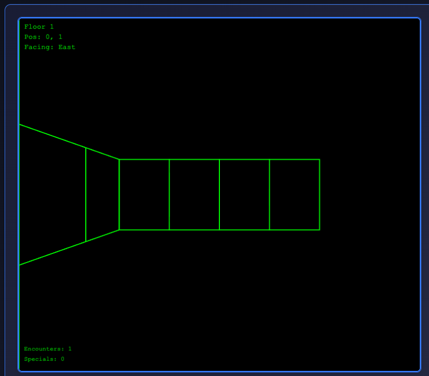
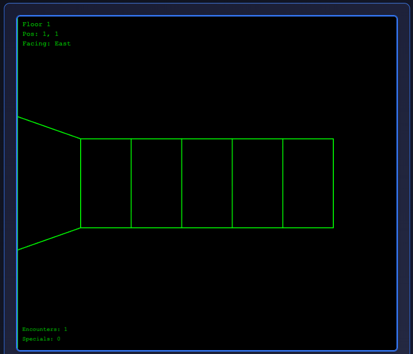
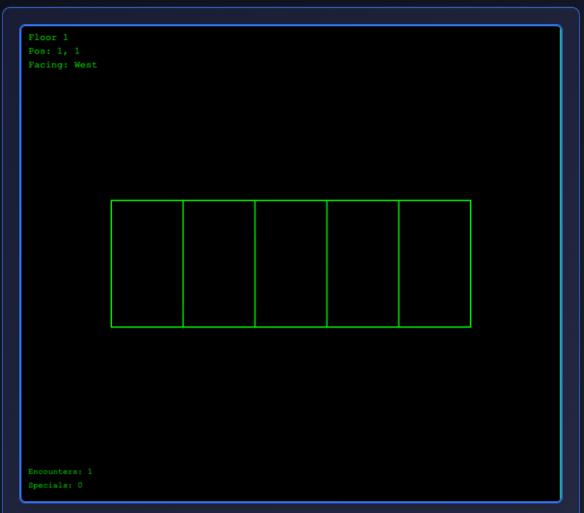

# Issue: Fake Corridor

## Location: Training Grounds (Test Environment)
```text
  0 1 2 3 4 5 6 7 8  (x coordinates)
0 █ █ █ █ █ █ █ █ █  
1 @ . . █ █ . . . █  (Room A)    (Room B)
2 . p . . O . T . █  (Room A)(corridor)(Room B)
3 . . . █ █ . . . █  (Room A)    (Room B)
4 █ █ █ █ █ █ █ █ █  

p = player start position (1,2)
O = fixed Ogre encounter at (4,2)
T = treasure chest at (6,2)
```

## Issue Description

I am in the corner of room a facing East


I move East once 

```text
  0 1 2 3 4 5 6 7 8  (x coordinates)
0 █ █ █ █ █ █ █ █ █  
1 . @ . █ █ . . . █  (Room A)    (Room B)
2 . p . . O . T . █  (Room A)(corridor)(Room B)
3 . . . █ █ . . . █  (Room A)    (Room B)
4 █ █ █ █ █ █ █ █ █  

p = player start position (1,2)
O = fixed Ogre encounter at (4,2)
T = treasure chest at (6,2)
```



I then turn around and face West (back at the spot I was just in)



You can see in the images that when I'm on (1,1) and facing East the wall on (0,2) is visibile on the left side of the viewport connected to the far wall. But when I face West the wall on (0,0) and possible (0,1) are not rendering and it looks like open space. Is there some directional correction that needs to be in place to render?