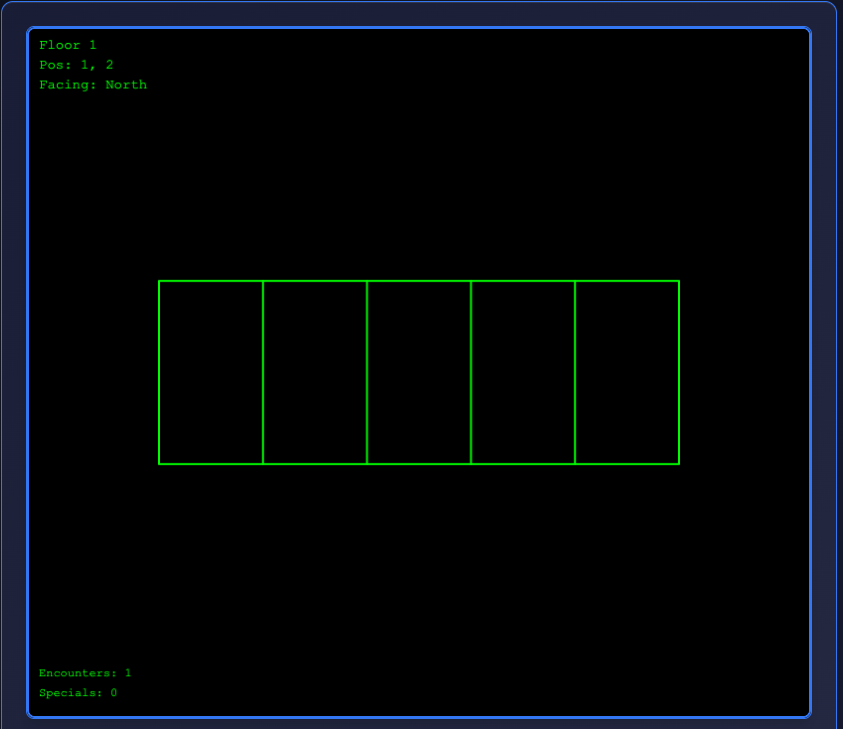
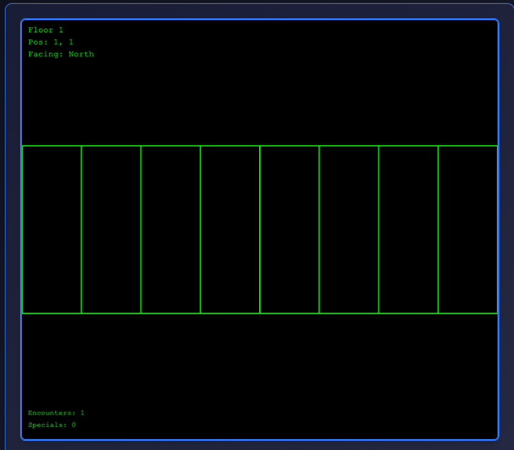
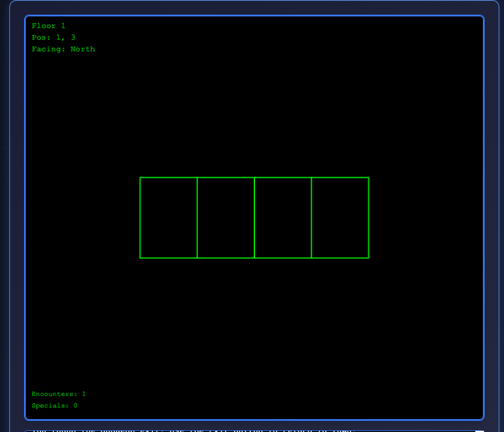

# Issue: Incorrect Distant Wall Rendering

## Location: Training Grounds (Test Environment)
```text
  0 1 2 3 4 5 6 7 8  (x coordinates)
0 █ █ █ █ █ █ █ █ █  
1 . . . █ █ . . . █  (Room A)    (Room B)
2 . @ . . O . T . █  (Room A)(corridor)(Room B)
3 . . . █ █ . . . █  (Room A)    (Room B)
4 █ █ █ █ █ █ █ █ █  

@ = player start position (1,2)
O = fixed Ogre encounter at (4,2)
T = treasure chest at (6,2)
```

## Issue Description

I am at the Jack (starting position) at (1,2) and facing North



I see 5 wall sections in the view port but empty space on the left and right side of the viewport. What walls are rendering in front of me?

When I move forward to (1,1) I see the wall extend across the viewport



If I go backwards twice to position (1,3) facing North I see:



---

There's inconsistency with the rendering of the distant walls. Also, should we be rendering the side walls while in the middle of the room at all? Should I see a "distant" left side wall and a "distant" right side wall with a gap for the corridor to room B?